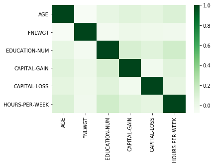

## Introducción
---

Como primer proyecto vamos a entrenar un modelo de regresion logistica.
Para ello seleccionamos el siguiente dataset de [UCI](https://archive.ics.uci.edu/ml/datasets/adult).
Antes de comenzar deberiamos de seguir algun proceso o métodologia que nos guie en el desarrollo de este proyecto.
Por suerte para nuestra ayuda existe una métodologia llamada **[CRISP-DM](http://crisp-dm.eu/)**, esta métodología cuenta con 6 etapas,las cuales son:

- Comprensión del negocio
- Entendimiento y analisis de los datos
- Preparacion de los datos
- Modelado
- Evaluación
- Despliegue

Iremos avanzando en el proyecto, paso a paso aplicando cada una de las etapa de **CRISP-DM**.
Mas adelante dedicaremos un post para hablar de esta metodología en profundidad, asi que por el momento manos a la obra!!!.


### Comprender el problema
---
Basandonos en la informacion adjunta al dataset el objetivo del problema es **clasificar** en base a **dos clases** si una persona gana mas, o menos de $50000 dolares al año, en base a un conjunto de atributos.

### Analisis de los datos
---
El dataset cuenta con 15 atributos incluyendo la variable Objetivo, esta dividio en un dos partes para el proposito de entrenamiento y el otro para test. La cantidad de instancias que posse cada conjunto es de
32560 y de 16281 respectivamente. Examinando los dataset podemos ver que los mismos no tiene los encabezados en la data, por lo que debemos leer toda documentación adjunta para poder saber los nombres de cada atributo y a que columna corresponde.


```python
#Vamos a leer nuestro archivo, para ello utilizaremos una libreria muy conocida llamada pandas.
import pandas as pd

#Leemos nuestro archivo para entrenamiento
ds_training=pd.read_csv("/home/eduardo/Escritorio/ML/Blog/problemas/Censo/adult.data")
print("Training data instances count:\t",ds_training.shape[0])

#Leemos nuestro archivo para test
ds_testing=pd.read_csv("/home/eduardo/Escritorio/ML/Blog/problemas/Censo/adult.test")
print("Testing data instances count :\t",ds_testing.shape[0])
```

    Training data instances count:	 32560
    Testing data instances count :	 16281


Una vez que hemos leido toda la información y sabemos cuales son los cabezales de nuestro conjunto de datos se los agregaremos.


```python
#Estos son los headers de los datos
headers=['AGE',	'WORKCLASS','FNLWGT','EDUCATION','EDUCATION-NUM','MARITAL-STATUS','OCCUPATION','RELATIONSHIP','RACE','SEX','CAPITAL-GAIN','CAPITAL-LOSS','HOURS-PER-WEEK','NATIVE-COUNTRY','CLASS']

#Se lo agregamos al dataset
ds_training.columns=headers

#Chequeamos que el header fue agregado.
dataset=ds_training

```

#### Tipos de datos
---
Vamos a revisar los tipos de datos que tiene nuestro dataset.
Como podemos ver muchos de nuestros atributos son polinomiales, para poder utilizarlos en una regresión logistica,
debemos aplicarles algun tipo de transformacion de **Polinomial a Númerico**. Pero antes debemos hacer un chequeo de datos faltantes.


```python
dataset.dtypes
```


    AGE                int64
    WORKCLASS         object
    FNLWGT             int64
    EDUCATION         object
    EDUCATION-NUM      int64
    MARITAL-STATUS    object
    OCCUPATION        object
    RELATIONSHIP      object
    RACE              object
    SEX               object
    CAPITAL-GAIN       int64
    CAPITAL-LOSS       int64
    HOURS-PER-WEEK     int64
    NATIVE-COUNTRY    object
    CLASS             object
    dtype: object


#### Datos Faltantes
---
Una vez que agregamos los headers al dataset comenzaremos a revisar mas en profundidad los datos, comenzaremos por cheuqear los datos faltantes. En el caso de este dataset los datos faltantes son marcado con la cadena **" ?"**, hagamos un recuento de estos.
Para ellos **reemplazaremos** la cadena **" ?"** por el valor **NaN de numpy**, esto lo hacemos ya que **pandas nos ofrece algunas funciones para hacer el recuento de estos valores**.


```python
dataset=dataset.replace(" ?", value=np.nan)
dataset.isna().sum()
```


    AGE                  0
    WORKCLASS         1836
    FNLWGT               0
    EDUCATION            0
    EDUCATION-NUM        0
    MARITAL-STATUS       0
    OCCUPATION        1843
    RELATIONSHIP         0
    RACE                 0
    SEX                  0
    CAPITAL-GAIN         0
    CAPITAL-LOSS         0
    HOURS-PER-WEEK       0
    NATIVE-COUNTRY     583
    CLASS                0
    dtype: int64


ahora vamos a ver que valores contienen dichos atributos, **agrupandolos** por tipo.


```python
print(dataset.groupby(['WORKCLASS']).size(),"\n")

print(dataset.groupby(['OCCUPATION']).size(),"\n")

print(dataset.groupby(['NATIVE-COUNTRY']).size())
```

    WORKCLASS
     Federal-gov           960
     Local-gov            2093
     Never-worked            7
     Private             22696
     Self-emp-inc         1116
     Self-emp-not-inc     2541
     State-gov            1297
     Without-pay            14
    dtype: int64

    OCCUPATION
     Adm-clerical         3769
     Armed-Forces            9
     Craft-repair         4099
     Exec-managerial      4066
     Farming-fishing       994
     Handlers-cleaners    1370
     Machine-op-inspct    2002
     Other-service        3295
     Priv-house-serv       149
     Prof-specialty       4140
     Protective-serv       649
     Sales                3650
     Tech-support          928
     Transport-moving     1597
    dtype: int64

    NATIVE-COUNTRY
     Cambodia                         19
     Canada                          121
     China                            75
     Columbia                         59
     Cuba                             95
     Dominican-Republic               70
     Ecuador                          28
     El-Salvador                     106
     England                          90
     France                           29
     Germany                         137
     Greece                           29
     Guatemala                        64
     Haiti                            44
     Holand-Netherlands                1
     Honduras                         13
     Hong                             20
     Hungary                          13
     India                           100
     Iran                             43
     Ireland                          24
     Italy                            73
     Jamaica                          81
     Japan                            62
     Laos                             18
     Mexico                          643
     Nicaragua                        34
     Outlying-US(Guam-USVI-etc)       14
     Peru                             31
     Philippines                     198
     Poland                           60
     Portugal                         37
     Puerto-Rico                     114
     Scotland                         12
     South                            80
     Taiwan                           51
     Thailand                         18
     Trinadad&Tobago                  19
     United-States                 29169
     Vietnam                          67
     Yugoslavia                       16
    dtype: int64


Podemos imputar valores utilizando sklearn, en este caso eliminaremos estas intancias.


```python
dataset=dataset.dropna()
dataset.isna().sum()
```


    AGE               0
    WORKCLASS         0
    FNLWGT            0
    EDUCATION         0
    EDUCATION-NUM     0
    MARITAL-STATUS    0
    OCCUPATION        0
    RELATIONSHIP      0
    RACE              0
    SEX               0
    CAPITAL-GAIN      0
    CAPITAL-LOSS      0
    HOURS-PER-WEEK    0
    NATIVE-COUNTRY    0
    CLASS             0
    dtype: int64


ahora no tenemos valores faltantes en nuestro dataset, como siguiente paso vamos a normalizar nuestros datos.


```python
import seaborn as sbn
correlationMatrix=dataset.corr()
sbn.heatmap(correlationMatrix,cmap="Greens")
```


    <matplotlib.axes._subplots.AxesSubplot at 0x7f808038c7f0>



